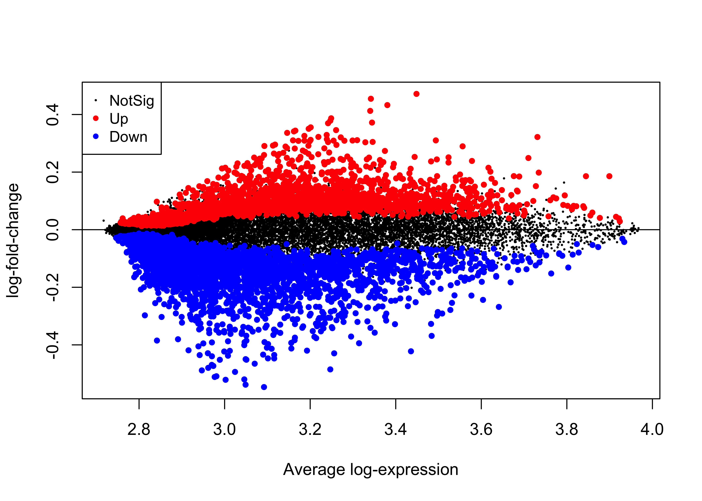
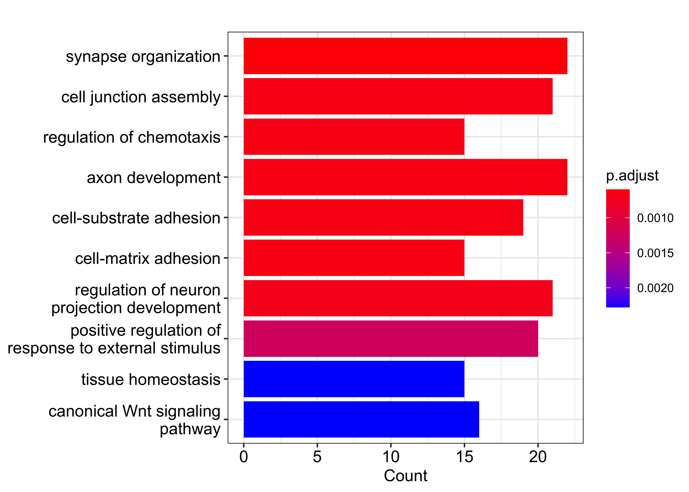

<style type="text/css">
/* Three image containers (use 25% for four, and 50% for two, etc) */
.column {
  float: left;
  width: 33.33%;
  padding: 5px;
}

/* Clear floats after image containers */
.row::after {
  content: "";
  clear: both;
  display: table;
}

</style>

         
<center>

<h1>

Amos Okutse, Naomi Lee

 12 May, 2022 

</h1>
<span>


</span>

</center>

# Motivation

Accurate predictions of prognostic outcomes are of substantial and pivotal significance in the context of quality care delivery. However, the application of deep learning models to enhance caregiving in healthcare has been limited by concerns related to the reliability of such methods. In this way, models that are robust and which can result in a throughput prediction of such clinical outcomes as survival while at the same time exhibiting high reliability and potential to be generalized to larger populations remain in high demand. As a result, there has been an emerging persistent interest in modeling survival data to leverage the promise deep learning models offer in this regard. This is not surprising given the significance of the healthcare sector, where we are often interested in understanding, for instance, the role that a specific differentially expressed gene plays concerning prognosis or, more generally, understanding how a given treatment regimen is likely to impact patient outcomes and in turn make decisions accordingly to perhaps improve patient outcomes related to care.


Analyzing time-to-event data involves is an inimitable problem given that the outcome of interest might comprise whether or not an event has occurred (binary outcome) but also the time when this event occurs (continuous outcome) [@feng2021bdnnsurv]. The problem is further complicated by missing data on the survival outcome of interest—censored data.^[Censoring refers to a concept in survival analysis where the actual time to event is unknown due to such reasons as the loss to follow up, withdrawals, or an exact unknown time of event. In right censoring, the event of interest occurs after the end of the experiment or study, whereas in left censoring, the event occurs before the onset of the study. Interval censoring is when the actual survival time is bounded between some interval]. The very nature of (censored) survival data makes it impossible to apply classical analysis methods such as logistic regression.

Additionally, models based on the Weibull model have restrictive assumptions, including a parametric form of the distribution of the time to event. Similarly, the semi-parametric Cox proportional hazards (PH) model [@burden2008bayesian] also has assumptions, a major one being the proportional hazards assumption: "the effect of a unit increase in a covariate is multiplicative with respect to the hazard rate." Despite the outcome of interest not always being a hazard rate, it can be a probability; for instance, the PH assumption does not make much sense, especially when we have a substantial number of covariates (we would need each of these covariates to satisfy this assumption). The performance of these methods has also been shown to be poor, especially when the underlying model is incorrectly specified [@feng2021bdnnsurv]. 

But how can we tackle the problem of modeling survival data amicably? This post reviews an extension of artificial neural networks (ANN) implemented based on the Cox PH model and trained to model survival data using Bayesian learning. In particular, we use a 2-layer feed-forward artificial neural network (ANN) trained using Bayesian inference to model survival outcomes and compare this model to the more traditional Cox proportional hazards model. Compared to previously studied models, we expect the ANN trained using Bayesian inference to perform better following its incorporation of Bayesian inference and neural networks. 

First, we introduce *neural networks in a more general context*, then discuss *the neural networks approach to modeling survival data* and how Bayesian inference has been introduced into these models to enhance their predictive capacity. Next, we introduce an application of the Bayesian learning artificial neural network (BLNN) using an R package of a similar name applied in modeling the effect of identified differentially expressed genes on the survival of patients with primary bladder cancer. Lastly, we compare this model to the more traditional Cox PH model for illustrative purposes and provide an extension code in Python.

# But what are neural networks?

With all the hype linked to this deep learning method in the recent past [@hastie2009elements], we provide a simplistic idea of what this method is. Defined: Neural networks are:

> "Computer systems with interconnected nodes designed like neurons to mimic the human brain in terms of intelligence. These networks use algorithms to discover hidden data structures and patterns, correlations, clusters, and classify them, learn and improve over time."

The idea is to take in simple functions as inputs and then allow these functions to build upon each other. The models are flexible enough to learn non-linear relationships rather than prescribing them as is in kernels or transformations. A neural network takes in an input vector of p features $X=(X_1, X_2, \cdots , X_p)$ and then creates a non-linear function to forecast an outcome variable, $Y$. While varied statistical models such as Bayesian additive regression trees (BART) and random forests exist, neural networks have a structure that contrasts them from these other methods. Figure 1 shows a feed-forward neural network with an input layer consisting of 4 input features, $X=(X_1, \cdots, X_4)$, a single hidden layer with 5 nodes $A_1, \cdots, A_5$, a non-linear activation function, $f(X)$ (output layer), and the desired outcome, $Y.$


The arrows show that the input layer is feeding into each of the nodes in the hidden layer which in turn feed into our activation function all the way to the outcome in a forward manner hence the name—"feed forward”. A general neural network model has the form:

\begin{align}
 f(X) & = \beta_0 + \sum_{k=1}^{K} \beta_k h_k (X)\\
& = \beta_0 + \sum_{k=1}^{K} \beta_k g(w_{k0} + \sum_{j=1}^{p}w_{kj}X_j)
\end{align}

In the first modeling step, the $K$ activations in the hidden layer are computed as functions of the features in the input layer, that is:

\begin{align}
A_k = h_k(X) &= g(w_{k0} + \sum_{j=1}^{p}w_{kj}X_j)\\
& =~~\textrm {where} ~g(z) = \textrm{non-linear activation function which has to be specified.}
\end{align}

The $K$ activation functions from the hidden layer then feed their outputs into the output layer so that we have:

\begin{align}
 f(X) & = \beta_0 + \sum_{k=1}^{K} \beta_k A_k
\end{align}

where $K$ in Figure 1 is 5. Parameters $\beta_0, \cdots, \beta_K$, as well as, $w_{10}, \cdots, w_{Kp}$ are estimated from the data. Quite a number of options exist for the activation function, $g(z).$ ^[Common activation functions include the sigmoid activation function favoured in classification problems, the rectified linear unit (ReLU) favoured in linear regression problems, tanh, and leaky ReLU.] The non-linearity of the activation function $g(z)$ allows the model to capture complex non-linear structures as well as interaction effects.

# The Artificial Neural Network Approach to modeling survival data

The BLNN implementation of Bayesian inference in artificial neural networks is based on the Cox PH-based neural model described by @sharaf2015two. In particular, the idea is to build a predictive model for survival using a neural network with $K$ outputs. $K$ here defines the number of periods. Using this neural network architecture, Mani et al. estimated a hazard function where for each individual, we have a training vector a $1 \times K $ of hazard probabilities $(h_{ik})$ defined as:
  \[ 
h_{ik}=
\begin{cases}
0 & ~\textrm{if} ~ 1\leq k \leq K \\
1 &~\textrm{if} ~ t \leq k \leq K ~ \textrm{and event = 1} \\
\frac{r_k}{n_k}~ \textrm{if}~ t \leq k \leq K ~ \textrm{and event = 0}
\end{cases}
\]
 where $h_{ik}=0$ if the event of interest did not occur (patient survived), $h_{ik} =1$ if event occurred at some time, $t$ and $h_{ik}=\frac{r_k}{n_k}$ if the subject is censored/ lost to follow -up during the course of the study, $t<K$. $h_{ik}=\frac{r_k}{n_k}$ is the Kaplan-Meier (KM) hazard estimate for time interval $k$ and $r_k$ and $n_k$ denote the number of events due to the risk factor of interest in time period $k$ and the number at risk in time interval $k.$ The neural network uses the logistic sigmoid activation function defined as:
\[
\Phi (x) = \frac{1}{1+e^{-x}}
\]

The weights for this network are obtained through a minimization of the cross-entropy loss function^[ formula defined here]. Figure 2 shows the architecture of a feed-forward neural network based on the Cox PH model with an input layer consisting of $p$ covariates and a bias term, a single hidden layer with $H$ nodes, and a single bias term. Lastly, we have an output layer with $K$ units, which learn to estimate the hazard probabilities associated with each individual at each time interval. The network's input layer feeds the hidden layer, which in turn feeds the output layer. The "feed-forward" naming convention is derived from this aspect of the architecture. The hazard estimates based on this neural network model are then converted to estimates of survival based on the survival function:

\[
S(t_k)=\prod_{l=1}^k (1-h(t_l))
\]

where $k$ denotes the disjoint intervals and $l$ the number of time periods in which the event occurred.


# Bayesian approach to inference using ANN

This post focuses on inference using a two-layer feed-forward artificial neural network. Specifically, we describe the Bayesian learning neural networks implemented by @sharaf2020blnn on a neural network-based implementation of the Cox proportional hazard model described above. In training neural networks using conventional methodologies, the aim is to find a local minimum of the error function, an ideology that makes model selection rather difficult. Additionally, as described elsewhere by [@hastie2009elements], the training of neural networks presents such an issue as overfitting, a situation where, even though the model performs extremely well on the training data, it fails to generalize well on resampling or when applied on unobserved data. Overfitting has been linked to these models having too many weights such that they overfit at the global minimum of $R$ [@lawrence1997lessons; @hastie2009elements]. According to @burden2008bayesian :

>"Bayesian regularized artificial neural networks (BRANNs) are more robust than standard backpropagation nets and can reduce or eliminate the need for lengthy cross-validation."

In the Bayesian context, the idea is to use prior information about the distribution of the parameter of interest, update this information using the sample data and obtain a posterior distribution for the parameter, $\theta$. BLNN tries to present Hamiltonian energy, $H(w, p)= U(w)+K(p)$ as a joint probability distribution of the neural network's weights, $w$ and momentum, $\textbf{p}$. Given independence between $w$ and $\textbf{p}$, this joint probability is defined as:

\[
P(w, p) = (\frac{1}{z} exp^{-U(w)/z})(\frac{1}{T}exp^{-K(p)/T})
\]
where: 
$U(w) =$ the negative log-likelihood of the posterior distribution defined as $U(w)=-log[p(w)L(w|D)]$ 
$L(w|D) =$ the likelihood function given the data <br>
$K(p) = \sum_{i=1}^{d}(P_i^2)/(2m_i) $  is the kinetic energy corresponding to the negative log-likelihood of the normal distribution with mean, $\mu$ and variance-covariance matrix with diagonal elements, $M=(m_1, \cdots, m_d)$<br>
$Z$ and $T$ are the normalizing constants.

The algorithm is summarized as below:


Source: Sharaf et. al (2020)

Details about the implementation of this method can be found [here]( https://rdrr.io/github/BLNNdevs/BLNN/#vignettes).

@sharaf2020blnn utilize a no-U-turn sampler (NUTS), an extension of Hamiltonian Monte-Carlo (HMC) that seeks to reduce the dependence on the number of step parameters used in HMC while retaining the efficiency in generating independent samples. The ANN is trained using both HMC and NUTS with dual averaging. The negative log-likelihood is replaced by network errors, and backpropagation is used to compute the gradients. Network errors and weights are assumed to be normally distributed with mean, $\mu$ but with a non-constant variance, $\sigma^2$. The variance of the prior is known by the precision parameter, $\tau = \frac{1}{\sigma^2}$ aka the hyperparameters which are either assigned to fixed, fine-tuned values or re-estimated based on historical data. The list of hyperparameters allowed in the BLNN implementation is discussed elsewhere [@sharaf2020blnn]. The following section provides a sample application of BLNNs applied to real-world data.

# Bayesian-based neural networks for modeling survival using micro-array data


## Introduction and data description

In our analyses in this section, we employ data consisting of 256 samples prepared using the Illumina Human-6 expression BeadChip Version 2.0 to identify DEGs and use bayesian neural networks to identify how these genes impact survival in patients with primary bladder cancer. The data relates to 165 primary bladder cancer samples and nine normal cells downloaded from the Gene Expression Omnibus (GEO) [@kim2010predictive; @okutse2021differential]. 


```r
#load the data from the GEO
gset <- getGEO("GSE13507", GSEMatrix =TRUE, AnnotGPL=TRUE)
if (length(gset) > 1) idx <- grep("GPL6102", attr(gset, "names")) else idx <- 1
gset <- gset[[idx]]

# make proper column names to match toptable 
fvarLabels(gset) <- make.names(fvarLabels(gset))

# group names for all samples
gsms <- paste0("0000000000XXXXXXXXXXXXXXXXXXXXXXXXXXXXXXXXXXXXXXXX",
               "XXXXXXXXXXXXXXXXXX22222222222222222222222222222222",
               "22222222222222222222222222222222222222222222222222",
               "22222222222222222222222222222222222222222222222222",
               "222222222222222222222222222222222XXXXXXXXXXXXXXXXX",
               "XXXXXX")
sml <- c()
for (i in 1:nchar(gsms)) { sml[i] <- substr(gsms,i,i) }

# eliminate samples marked as "X"
sel <- which(sml != "X")
sml <- sml[sel]
gset <- gset[ ,sel]

# log2 transform
exprs(gset) <- log2(exprs(gset))

# set up the data and proceed with analysis
sml <- paste("G", sml, sep="")    # set group names
fl <- as.factor(sml)
gset$description <- fl
design <- model.matrix(~ description + 0, gset)
colnames(design) <- levels(fl)
fit <- lmFit(gset, design)
cont.matrix <- makeContrasts(G2-G0, levels=design)
fit2 <- contrasts.fit(fit, cont.matrix)
fit2 <- eBayes(fit2, 0.01)

tT <- topTable(fit2, adjust="fdr", sort.by="B", number=Inf) 
#tt<-subset(tT, select=c("Gene.symbol","logFC","AveExpr","t","P.Value","adj.P.Val","B"))
#dat<-subset(tT, select=c("Gene.symbol","logFC","adj.P.Val"))
```

## Exploratory data analysis and DEG identification

First, we perform some exploratory data analysis on these data. We perform data transformation including sample normalization and log2 transformation then use eBayes ^[link here] to fit a model for differential expression analysis. We then present a sample of 10 up and down regulated genes in Table \@ref(tab:table1). In Figure \@ref(fig:mean-difference) we visualize the differentially expressed genes in this sample using a mean-difference plot. 


```r
#top regulated genes
upregulated<-tT[which(tT$logFC>0),][1:10,]
#upregulated
upregulated<-subset(upregulated, select=c("Gene.ID", "Gene.symbol","logFC","AveExpr","adj.P.Val","B"))
##getting top 10 downregulated genes
downreg<-tT[which(tT$logFC<0),][1:10,]
downreg<-subset(downreg, select=c("Gene.ID","Gene.symbol","logFC","AveExpr","adj.P.Val","B"))

deg<-rbind(upregulated, downreg) 
rownames(deg)<-NULL
deg%>% kable(format = "html", 
             caption = "Top 10 up and down regulated genes in primary bladder cancer. The first 10 rows represent upregulated genes",
             col.names = c("Gene ID", "Gene Symbol", "logFC", "Average Expression", "Adjusted P-value", "B")) %>%
  kable_styling(full_width = FALSE, latex_options = c("HOLD_position", "stripped", "scale_down"), position = "left")
```

<table class="table" style="width: auto !important; ">
<caption>(\#tab:table1)Top 10 up and down regulated genes in primary bladder cancer. The first 10 rows represent upregulated genes</caption>
 <thead>
  <tr>
   <th style="text-align:left;"> Gene ID </th>
   <th style="text-align:left;"> Gene Symbol </th>
   <th style="text-align:right;"> logFC </th>
   <th style="text-align:right;"> Average Expression </th>
   <th style="text-align:right;"> Adjusted P-value </th>
   <th style="text-align:right;"> B </th>
  </tr>
 </thead>
<tbody>
  <tr>
   <td style="text-align:left;"> 991 </td>
   <td style="text-align:left;"> CDC20 </td>
   <td style="text-align:right;"> 0.4715744 </td>
   <td style="text-align:right;"> 3.448492 </td>
   <td style="text-align:right;"> 0e+00 </td>
   <td style="text-align:right;"> 15.80790 </td>
  </tr>
  <tr>
   <td style="text-align:left;"> 5373 </td>
   <td style="text-align:left;"> PMM2 </td>
   <td style="text-align:right;"> 0.1710619 </td>
   <td style="text-align:right;"> 3.338349 </td>
   <td style="text-align:right;"> 0e+00 </td>
   <td style="text-align:right;"> 15.27138 </td>
  </tr>
  <tr>
   <td style="text-align:left;"> 128239 </td>
   <td style="text-align:left;"> IQGAP3 </td>
   <td style="text-align:right;"> 0.4125383 </td>
   <td style="text-align:right;"> 3.340340 </td>
   <td style="text-align:right;"> 0e+00 </td>
   <td style="text-align:right;"> 14.95455 </td>
  </tr>
  <tr>
   <td style="text-align:left;">  </td>
   <td style="text-align:left;">  </td>
   <td style="text-align:right;"> 0.2268436 </td>
   <td style="text-align:right;"> 3.233782 </td>
   <td style="text-align:right;"> 0e+00 </td>
   <td style="text-align:right;"> 13.79589 </td>
  </tr>
  <tr>
   <td style="text-align:left;"> 2932 </td>
   <td style="text-align:left;"> GSK3B </td>
   <td style="text-align:right;"> 0.1896154 </td>
   <td style="text-align:right;"> 3.377058 </td>
   <td style="text-align:right;"> 1e-07 </td>
   <td style="text-align:right;"> 12.82440 </td>
  </tr>
  <tr>
   <td style="text-align:left;"> 51537 </td>
   <td style="text-align:left;"> MTFP1 </td>
   <td style="text-align:right;"> 0.2168117 </td>
   <td style="text-align:right;"> 3.393753 </td>
   <td style="text-align:right;"> 2e-07 </td>
   <td style="text-align:right;"> 12.03233 </td>
  </tr>
  <tr>
   <td style="text-align:left;"> 51203 </td>
   <td style="text-align:left;"> NUSAP1 </td>
   <td style="text-align:right;"> 0.3719761 </td>
   <td style="text-align:right;"> 3.344562 </td>
   <td style="text-align:right;"> 3e-07 </td>
   <td style="text-align:right;"> 11.28112 </td>
  </tr>
  <tr>
   <td style="text-align:left;"> 7153 </td>
   <td style="text-align:left;"> TOP2A </td>
   <td style="text-align:right;"> 0.4546483 </td>
   <td style="text-align:right;"> 3.341922 </td>
   <td style="text-align:right;"> 4e-07 </td>
   <td style="text-align:right;"> 11.09297 </td>
  </tr>
  <tr>
   <td style="text-align:left;">  </td>
   <td style="text-align:left;">  </td>
   <td style="text-align:right;"> 0.0471829 </td>
   <td style="text-align:right;"> 2.866252 </td>
   <td style="text-align:right;"> 5e-07 </td>
   <td style="text-align:right;"> 10.82223 </td>
  </tr>
  <tr>
   <td style="text-align:left;"> 2810 </td>
   <td style="text-align:left;"> SFN </td>
   <td style="text-align:right;"> 0.3100817 </td>
   <td style="text-align:right;"> 3.493720 </td>
   <td style="text-align:right;"> 8e-07 </td>
   <td style="text-align:right;"> 10.18284 </td>
  </tr>
  <tr>
   <td style="text-align:left;"> 9890 </td>
   <td style="text-align:left;"> PLPPR4 </td>
   <td style="text-align:right;"> -0.3804426 </td>
   <td style="text-align:right;"> 2.891050 </td>
   <td style="text-align:right;"> 0e+00 </td>
   <td style="text-align:right;"> 50.66289 </td>
  </tr>
  <tr>
   <td style="text-align:left;">  </td>
   <td style="text-align:left;">  </td>
   <td style="text-align:right;"> -0.0622618 </td>
   <td style="text-align:right;"> 2.808016 </td>
   <td style="text-align:right;"> 0e+00 </td>
   <td style="text-align:right;"> 42.95524 </td>
  </tr>
  <tr>
   <td style="text-align:left;"> 54360 </td>
   <td style="text-align:left;"> CYTL1 </td>
   <td style="text-align:right;"> -0.2690733 </td>
   <td style="text-align:right;"> 2.886378 </td>
   <td style="text-align:right;"> 0e+00 </td>
   <td style="text-align:right;"> 41.75689 </td>
  </tr>
  <tr>
   <td style="text-align:left;"> 11126 </td>
   <td style="text-align:left;"> CD160 </td>
   <td style="text-align:right;"> -0.1475023 </td>
   <td style="text-align:right;"> 2.853721 </td>
   <td style="text-align:right;"> 0e+00 </td>
   <td style="text-align:right;"> 38.93153 </td>
  </tr>
  <tr>
   <td style="text-align:left;"> 121601 </td>
   <td style="text-align:left;"> ANO4 </td>
   <td style="text-align:right;"> -0.1705039 </td>
   <td style="text-align:right;"> 2.827650 </td>
   <td style="text-align:right;"> 0e+00 </td>
   <td style="text-align:right;"> 36.38865 </td>
  </tr>
  <tr>
   <td style="text-align:left;"> 5126 </td>
   <td style="text-align:left;"> PCSK2 </td>
   <td style="text-align:right;"> -0.1268787 </td>
   <td style="text-align:right;"> 2.823028 </td>
   <td style="text-align:right;"> 0e+00 </td>
   <td style="text-align:right;"> 34.23361 </td>
  </tr>
  <tr>
   <td style="text-align:left;"> 9745 </td>
   <td style="text-align:left;"> ZNF536 </td>
   <td style="text-align:right;"> -0.2280635 </td>
   <td style="text-align:right;"> 2.898368 </td>
   <td style="text-align:right;"> 0e+00 </td>
   <td style="text-align:right;"> 34.04707 </td>
  </tr>
  <tr>
   <td style="text-align:left;"> 55022 </td>
   <td style="text-align:left;"> PID1 </td>
   <td style="text-align:right;"> -0.3029122 </td>
   <td style="text-align:right;"> 2.899585 </td>
   <td style="text-align:right;"> 0e+00 </td>
   <td style="text-align:right;"> 33.04130 </td>
  </tr>
  <tr>
   <td style="text-align:left;">  </td>
   <td style="text-align:left;">  </td>
   <td style="text-align:right;"> -0.2550758 </td>
   <td style="text-align:right;"> 2.837756 </td>
   <td style="text-align:right;"> 0e+00 </td>
   <td style="text-align:right;"> 32.74756 </td>
  </tr>
  <tr>
   <td style="text-align:left;"> 10699 </td>
   <td style="text-align:left;"> CORIN </td>
   <td style="text-align:right;"> -0.1867473 </td>
   <td style="text-align:right;"> 2.868771 </td>
   <td style="text-align:right;"> 0e+00 </td>
   <td style="text-align:right;"> 32.25715 </td>
  </tr>
</tbody>
</table>


<div class="figure">

<p class="caption">(\#fig:mean-difference)A mean-difference plot showing the statistically significantly up and down regulated genes in primary bladder cancer relative to normal bladder cells.</p>
</div>

Additionally, we perform a basic functional enrichment analysis using Gene Ontology (GO) enrichment analysis and a small fraction of the DEGs (n = 300 genes) to identify the pathways where this statistically significantly differentially expressed genes are enriched. Here, we use a basic barplot to visualize the most common GO terms. We note in Figure \@ref(fig:enrich) that some of these genes are involved in a number of biological functions including synapse organization as well as junction assembly and neural migration.


```r
#using clusteRprofiler to get the networks of genes in relation to function
#cnetplot(edo, foldChange = gene_symbols, circular=TRUE, colorEdge = TRUE, showCategory = 20)
#barplots of the similar results showing only 20 enrichment categories
barplot(edo, showCategory=10, cex.names=3)
```

<div class="figure">

<p class="caption">(\#fig:enrich)Sample Enrichment analysis results using the Gene Ontology (GO) enrichment analysis.</p>
</div>

# Neural Networks with Bayesian Learning 

The data used in this analysis consists of 43148 observations on 256 variables. First, we begin by cleaning up the data in preparation for downstream analysis and then select a sample of genes for our analysis here. For brevity we perform analyses on a sample of n=2000 genes. 


Here, we install package `remotes` and then use it to install the development version of the BLNN package which allows us to use Bayesian learning neural networks and apply these to our dataset. We install this package using the command `remotes::install_github("BLNNdevs/BLNN")` and then select a sample of about 1375 gene probes to use in downstream analysis. 


```r
#install the package BLNN
#install.packages("remotes")
#remotes::install_github("BLNNdevs/BLNN")
library(BLNN)
#load the probes to be used in analysis
probes<-read.csv("probs.csv")
coxdata<-coxdata[, 8:ncol(coxdata)]
#filter the data to only selected probes from the probes data file
names<-names(coxdata) %in% probes$x
coxdata<-coxdata[, names]
#add the survival data column to this subset data
coxdata$overall_survival<-overall_survival
#coxdata<-data.frame(overall_survival, coxdata)
#str(coxdata)

#create a matrix from the data
mod<-model.matrix(overall_survival~.,
                  data = coxdata)
#create the training matrix of covariates and the response vector, y
trainx<-mod[, 2:ncol(mod)]
trainy<-coxdata$overall_survival
```


```r
#build the BLNN object
survObj<-BLNN_Build(ncov = 1375, nout = 1, hlayer_size = 10,
                    actF = "tanh", outF = "sigmoid", cost = "crossEntropy",
                    hp.Err = 20, hp.W1 = rep(1, ncol(trainx)), hp.W2 = 1,
                    hp.B1 = 1, hp.B2 = 1)
#print(survObj)
```


```r
trainxx<-coxdata[,1:1375]
#network weights
n.par<-length(BLNN_GetWts(survObj))
#number of desired chains
chains<-2
#initials weight values
initials<-lapply(1:chains, function(i) rnorm(length(BLNN_GetWts(survObj)), 0, 1/sqrt(n.par)))

#variance for the moments
m1<-rep(1/2, n.par)
#trainx<-as.array(trainx)
#start the training
#trainxx<-array(trainx, dim = c(165, 1375, 0))

survNUTS<-BLNN_Train(survObj, x=trainxx, y=trainy,
                     iter = 5000, thin = 10, warmup = 400,
                     init = initials, chains = chains,
                     algorithm = "HMC", evidence = FALSE,
                     control = list(adapt_delta=0.99, momentum_mass=m1, 
                                    stepsize=1, gamma=15, to=10, useDA=TRUE,
                                    max_treedepth=20))
```


```r
#model predictions without evidence
predicted1<-BLNN_Predict(survObj, trainx, fit = survNUTS)
#predict using the neural network with evidence
#predicted2<-BLNN_Predict(survObj, trainx, fit = survNUTS.ev)
```


# Discussion


# Python extension


# References

<div id= "refs"></div>


